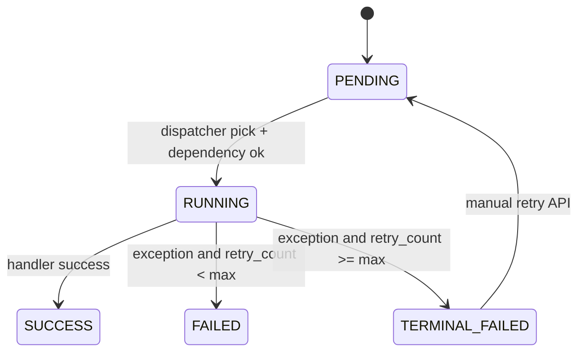
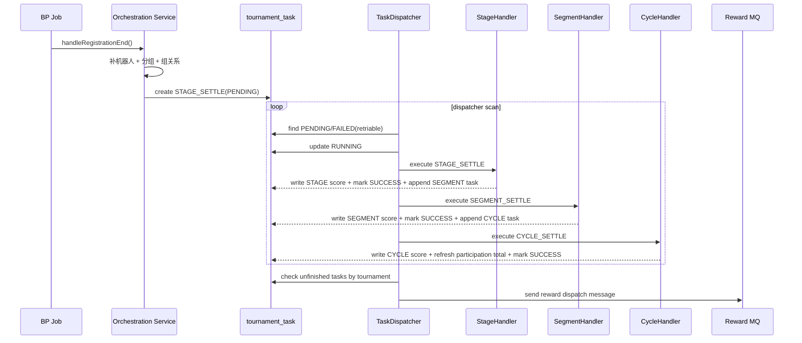

# Tournament Task 任务编排设计方案

## 1. 背景与目标

当前赛事结算链路需要满足以下要求：

- BP 仅触发，不承载复杂业务编排。
- 任务链具备可观测、可重试、可补偿能力。
- 结算完成后通过 MQ 事件驱动发奖。
- 任务链全链路可通过 `run_trace_id` 追踪。

本方案覆盖：`tournament_task` 表设计、四类任务的数据流转、任务交互关系、状态机、异常与补偿策略。

## 2. 任务分层与职责

### 2.1 四类任务

| 任务 | 类型 | 职责 | 是否落 `tournament_task` |
|---|---|---|---|
| 报名截止编排 | Orchestration | 补机器人、分组、组内绑定、初始化 Stage 任务 | 否（入口编排） |
| 场次结算 | `STAGE_SETTLE` | 聚合挑战记录，写入 STAGE 分数 | 是 |
| 片结算 | `SEGMENT_SETTLE` | 聚合 STAGE 分数，写入 SEGMENT 分数 | 是 |
| 周期结算 | `CYCLE_SETTLE` | 聚合 SEGMENT 分数，写入 CYCLE 分数并回写总分 | 是 |

### 2.2 模块边界

- BP Job：定时触发 service 端编排接口。
- Service 编排：判断时间窗口、初始化或补齐任务。
- Dispatcher：轮询任务表、依赖校验、驱动策略执行、状态推进。
- Handler Strategy：按任务类型执行具体聚合写入。
- Reward Listener + Producer：周期结算收敛后发送 MQ 发奖消息。

## 3. `tournament_task` 表设计

### 3.1 字段语义

| 字段 | 类型 | 说明 |
|---|---|---|
| `id` | bigint | 任务主键 |
| `tournament_id` | bigint | 赛事配置 ID（`tournament_config.id`） |
| `event_game_id` | bigint | 玩法 ID（`event_game_id`） |
| `task_type` | tinyint | 任务类型：Stage/Segment/Cycle |
| `stage_no` | int | 场次号 |
| `segment_no` | int | 片号 |
| `cycle_no` | int | 周期号 |
| `trigger_time` | datetime | 最早执行时间 |
| `status` | tinyint | `PENDING`/`RUNNING`/`SUCCESS`/`FAILED`/`TERMINAL_FAILED` |
| `retry_count` | int | 当前重试次数 |
| `depends_on_task_id` | bigint | 依赖任务 ID |
| `depends_on_status` | tinyint | 依赖状态（通常 `SUCCESS`） |
| `run_trace_id` | varchar | 同一轮链路追踪 ID |
| 审计字段 | - | 创建人/时间、更新人/时间 |

### 3.2 推荐索引

| 索引 | 用途 |
|---|---|
| `(trigger_time, status)` | 调度扫描 |
| `(tournament_id, status)` | 赛事维度未完成判断 |
| `(event_game_id, status)` | 玩法维度排障 |
| `(tournament_id, stage_no, status)` | Stage 范围查询 |
| `(tournament_id, segment_no, status)` | Segment 范围查询 |
| `(tournament_id, cycle_no, status)` | Cycle 范围查询 |
| `(depends_on_task_id, depends_on_status)` | 依赖判定 |
| `(run_trace_id)` | 链路追踪 |

## 4. 任务状态机

### 4.1 状态流转

### 4.2 状态规则

- 仅 `PENDING` 和可自动重试的 `FAILED` 会被调度器再次拉起。
- `TERMINAL_FAILED` 必须人工调用重试接口才能回到 `PENDING`。
- 依赖不满足时保持原状态，不进入 `RUNNING`。

## 5. 任务间交互与数据流转

### 5.1 主流程时序

### 5.2 读写矩阵

| 任务 | 读取数据 | 写入数据 |
|---|---|---|
| 报名截止编排 | 赛事配置、报名记录 | 机器人报名、分组、分组关系、Stage 任务 |
| Stage 结算 | 挑战记录 | `tournament_score_record`（STAGE） |
| Segment 结算 | STAGE 分数 | `tournament_score_record`（SEGMENT） |
| Cycle 结算 | SEGMENT 分数 | `tournament_score_record`（CYCLE）、`tournament_participation_record.total_score` |
| 发奖事件 | 任务收敛状态 | MQ 消息（发奖请求） |

## 6. 依赖与去重策略

### 6.1 依赖策略

- 下游任务创建时写入：
  - `depends_on_task_id = 上游任务id`
  - `depends_on_status = SUCCESS`
- 调度器执行前先判定依赖任务状态是否满足。

### 6.2 去重策略

- 初始化任务幂等：赛事维度若已存在任务则跳过初始化。
- 追加任务幂等：同作用域（stage/segment/cycle）+ `task_type` 已存在则不重复创建。
- MQ 幂等键建议：`runTraceId + tournamentId + cycleNo`。

## 7. 异常处理与补偿

### 7.1 自动重试

- Handler 抛异常后：
  - `retry_count + 1`
  - 未达阈值：状态置 `FAILED`
  - 达阈值：状态置 `TERMINAL_FAILED`

### 7.2 人工补偿

- 仅允许对 `TERMINAL_FAILED` 执行手工重试。
- 重试动作：状态置 `PENDING`，`trigger_time = now`。

### 7.3 失败可见性

- 日志必须包含：`taskId`、`taskType`、`tournamentId`、`eventGameId`、`stageNo`、`segmentNo`、`cycleNo`、`runTraceId`。

## 8. 可观测性与运维

### 8.1 关键指标

- `pending_task_count`
- `failed_task_count`
- `terminal_failed_task_count`
- `task_dispatch_latency`
- `reward_mq_send_success_rate`

### 8.2 建议运维接口

- 初始化任务。
- 查询任务分页（含 `runTraceId` 过滤）。
- 手工重试终态失败任务。
- 手动触发 registration-end/stage-end 编排。
- 手动执行一次 dispatcher。

## 9. 验收清单

- 正常场景：Stage -> Segment -> Cycle 全链路 `SUCCESS`。
- 异常场景：故意抛错可观察到 `FAILED` 与 `TERMINAL_FAILED`。
- 补偿场景：手工重试后任务可继续推进。
- 发奖场景：Cycle 收敛后只发送一条发奖 MQ 消息。
- 幂等场景：重复触发编排不产生重复同域任务。

## 10. 扩展建议

- 增加 `biz_dedup_key` 列用于跨节点强幂等。
- 增加任务执行历史表记录每次重试的异常快照。
- 将发奖消息升级为事务外盒（Outbox）模式，进一步提升一致性。

## 11. 设计到实现映射（当前代码）

### 11.1 Job 触发层（BP -> Service）

| 设计角色 | 当前实现类 | 入口方法 | 说明 |
|---|---|---|---|
| 报名截止触发 Job | `RegistrationEndJob` | `jobExecute(JobArgs)` | 调用 `TournamentTaskClient.handleRegistrationEnd()` |
| 阶段结束触发 Job | `StageEndJob` | `jobExecute(JobArgs)` | 调用 `TournamentTaskClient.handleStageEnd()` |

### 11.2 API 与编排入口

| 设计角色 | 当前实现类 | 关键方法 | 说明 |
|---|---|---|---|
| 任务调度 API 门面 | `TournamentTaskResource` | `handleRegistrationEnd()` | 报名截止编排入口 |
| 任务调度 API 门面 | `TournamentTaskResource` | `handleStageEnd()` | 阶段结束编排入口 |
| 任务调度 API 门面 | `TournamentTaskResource` | `dispatchPendingTasks()` | 轮询调度入口 |
| 任务调度 API 门面 | `TournamentTaskResource` | `retryTerminalFailedTask(taskId)` | 人工补偿入口 |
| 报名截止编排服务 | `RegistrationEndOrchestrationService` | `handleRegistrationEnd()` | 补机器人、分组、绑定、初始化任务 |
| 阶段结束编排服务 | `StageEndOrchestrationService` | `handleStageEnd()` | 时间窗到达后触发任务初始化兜底 |
| 任务管理服务 | `TournamentTaskManageService` | `initSettlementTasks(tournamentId)` | 初始化 Stage 任务（幂等） |

### 11.3 调度内核与状态推进

| 设计角色 | 当前实现类 | 关键方法 | 说明 |
|---|---|---|---|
| 调度器 | `TaskDispatcherService` | `dispatchPendingTasks()` | 扫描 `PENDING` + 可重试 `FAILED` |
| 状态推进 | `TaskDispatcherService` | `processSingleTask(task)` | 依赖检查 -> RUNNING -> SUCCESS/FAILED |
| 失败处理 | `TaskDispatcherService` | `markFailed(task, ex)` | 达阈值转 `TERMINAL_FAILED` |
| 下游任务追加 | `TaskDispatcherService` | `appendNextTaskOnSuccess(task)` | Stage 成功追加 Segment；Segment 成功追加 Cycle |
| 任务收敛判断 | `TaskDispatcherService` | `hasUnfinishedTasks(tournamentId)` | 当前口径：`PENDING`/`RUNNING`/`FAILED` |
| 发奖事件触发 | `TaskDispatcherService` | `emitRewardDispatchEventIfReady(task)` | `CYCLE_SETTLE` 成功且无未完成任务时发布事件 |

### 11.4 三类业务 Handler 映射

| 任务类型 | 当前实现类 | 核心读取 | 核心写入 |
|---|---|---|---|
| `STAGE_SETTLE` | `StageSettleTaskHandlerStrategy` | `tournament_challenge_record`（完成挑战） | `tournament_score_record`（STAGE） |
| `SEGMENT_SETTLE` | `SegmentSettleTaskHandlerStrategy` | `tournament_score_record`（STAGE） | `tournament_score_record`（SEGMENT） |
| `CYCLE_SETTLE` | `CycleSettleTaskHandlerStrategy` | `tournament_score_record`（SEGMENT） | `tournament_score_record`（CYCLE）+ 参赛总分 |

### 11.5 奖励事件链路映射

| 设计角色 | 当前实现类 | 关键方法 | 说明 |
|---|---|---|---|
| 领域事件 | `TournamentRewardDispatchRequestedEvent` | record | 由调度器发布 |
| 事件监听 | `TournamentRewardDispatchEventListener` | `onRewardDispatchRequested(event)` | 接收事件并发送 MQ |
| MQ 生产者 | `TournamentRewardDispatchProducer` | `send(event)` | 组装消息并调用 `SilenceContentProducer.sendWithTag(...)` |
| MQ 消息体 | `TournamentRewardDispatchMessage` | record | 发奖请求负载，包含 `runTraceId` |

## 12. 对外交互接口清单（当前）

以下接口由 `TournamentTaskService` 对外定义、`TournamentTaskResource` 实现：

| 方法 | 路径 | 用途 |
|---|---|---|
| GET | `/tournament-tasks` | 任务分页查询 |
| POST | `/tournament-tasks/init` | 初始化赛事任务链 |
| POST | `/tournament-tasks/{taskId}/retry` | 手工重试终态失败任务 |
| POST | `/tournament-tasks/registration-end/handle` | 报名截止编排触发 |
| POST | `/tournament-tasks/stage-end/handle` | 阶段结束编排触发 |
| POST | `/tournament-tasks/dispatch` | 执行一轮调度 |
| GET | `/tournament-tasks/unfinished` | 查询是否有未完成任务 |

## 13. 实施注意事项（与当前实现一致）

- 当前 `hasUnfinishedTasks` 已将 `FAILED` 纳入未完成口径，防止失败任务未处理即触发发奖。
- `TERMINAL_FAILED` 不在自动调度范围内，需人工重试恢复到 `PENDING`。
- 发奖消息 topic/tag 当前由 `@Value` 默认值提供，不依赖 yml 配置。
- 下游任务追加逻辑已内置幂等检查（同作用域 + 同 taskType 不重复创建）。

## 14. 时序压测与容量建议

### 14.1 关键容量公式

可先用下列近似公式做容量预估：

- 总任务量：`TaskTotal ~= TournamentCount * AvgStageCount * 3`
- 单轮扫描压力：`ScanRows ~= Pending + FailedRetriable`
- 平均吞吐：`TPS ~= BatchSize / DispatchIntervalSeconds`
- 任务平均排队时延（粗估）：`QueueDelay ~= Pending / TPS`

说明：当前链路中，Stage/Segment/Cycle 三类业务任务都进入任务表，因此每个场次会贡献约 3 条任务。

### 14.2 调度参数建议

| 参数 | 建议初值 | 调优方向 |
|---|---|---|
| `BATCH_SIZE` | 100 | 积压严重时升到 200~500，观察 DB CPU 与锁等待 |
| 调度周期 | 3~5 秒 | 低峰可放大，高峰可缩短 |
| `MAX_RETRY_COUNT` | 3 | 对瞬时故障可提升到 5；逻辑错误不建议提高 |
| Handler 单批查询大小 | 2000 | 根据单赛事参与人数与 SQL 耗时调优 |

调优原则：优先扩大并行实例数，其次再扩大单实例 batch，避免单节点 SQL 峰值过高。

### 14.3 数据库与索引命中建议

压测前建议确认以下查询均命中索引：

- 调度扫描：按 `trigger_time + status`。
- 赛事未完成判断：按 `tournament_id + status`。
- 依赖检查：按 `depends_on_task_id + depends_on_status`。
- 同作用域去重检查：按 `tournament_id + scope(stage/segment/cycle) + status`。

压测时建议开启以下观测：

- 慢查询日志（建议阈值 100ms 或 200ms）。
- 查询执行计划（重点关注任务扫描与聚合查询）。
- 行锁等待与死锁统计。

### 14.4 压测场景矩阵

| 场景 | 目的 | 关键观测 |
|---|---|---|
| 正常链路压测 | 验证 Stage->Segment->Cycle 吞吐 | 完成率、平均时延、P95/P99 |
| 积压恢复压测 | 验证 backlog 消化能力 | backlog 下降斜率、清空时间 |
| 故障重试压测 | 验证 FAILED/TERMINAL_FAILED 行为 | 重试次数分布、终态失败比率 |
| 发奖链路压测 | 验证结算收敛后 MQ 发送稳定性 | 发送成功率、重复消息率 |
| 多实例并发压测 | 验证并发下幂等与去重 | 重复任务数、重复发奖数 |

### 14.5 建议监控阈值

可先采用如下告警线，后续按业务峰值修正：

- `pending_task_count` 持续 10 分钟上升：告警。
- `terminal_failed_task_count` > 0：高优先级告警。
- 调度周期内成功处理数 < 新增数（连续 5 分钟）：容量不足告警。
- MQ 发奖发送成功率 < 99.9%：告警。
- 单任务平均执行时长超过基线 2 倍：性能退化告警。

### 14.6 上线与回滚预案

上线前：

- 完成全链路压测并留存基线（TPS、P95、积压恢复时长）。
- 完成异常注入（DB 超时、MQ 超时、Handler 异常）。
- 完成人工补偿演练（`TERMINAL_FAILED -> PENDING`）。

回滚策略建议：

- 先暂停 dispatcher 触发，再处理在途任务。
- 保留任务表数据，不做删除，便于按 `run_trace_id` 回溯。
- 回滚后先验证“任务不再增长”，再逐步恢复触发。

### 14.7 后续优化方向

- 增加任务分片路由（按 `tournament_id` 哈希）降低热点。
- 在任务表增加可选 `next_retry_time`，实现指数退避重试。
- 对高频聚合任务引入增量结算或预聚合表，降低全量扫描。
