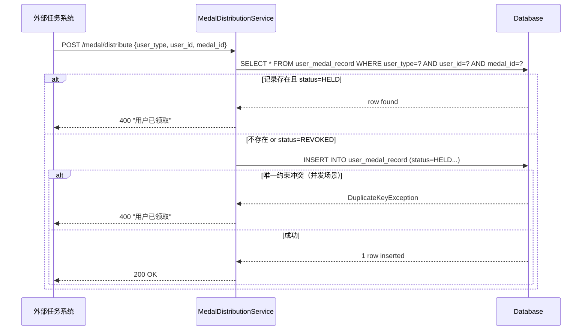
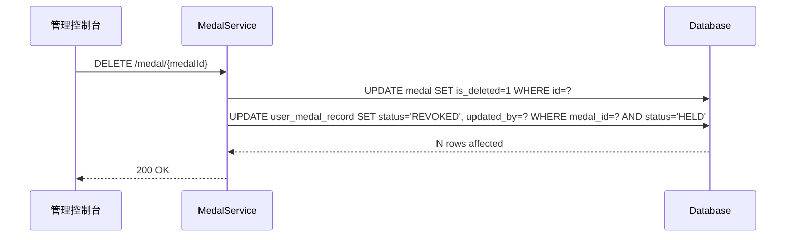
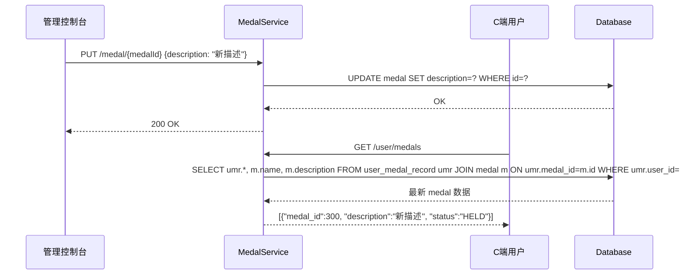

# Design: 勋章权益

## 架构决策

### 决策 1：勋章定义与通用权益共表 or 独立表

**选择**：独立表（`medal`）。

**理由**：勋章的唯一性约束（`category + name`）、UI 隔离需求和审计字段均与通用权益有差异，合表会引入复杂的类型判断逻辑，独立表职责更清晰。

---

### 决策 2：持有记录状态机

**状态**：`HELD`（已获得）/ `REVOKED`（已回收，等同于未获得）

**流转规则**：
- 首次下发 → `HELD`
- 管理员删除勋章 → `HELD → REVOKED`（系统一致性处理）
- 重建新 `medal_id` 并满足条件 → `HELD`（新记录，不受旧 `REVOKED` 影响）

---

### 决策 3：幂等保障层级

**数据库层**：`UNIQUE INDEX (user_type, user_id, medal_id)` 是最终保障。

**Service 层**：下发前先查询持有记录，存在且 `HELD` 则提前返回"用户已领取"，减少数据库约束冲突。

---

### 决策 4：编辑后内容同步策略

勋章持有记录只存 `medal_id`，不冗余内容字段。用户查询时 JOIN `medal` 表获取最新内容，天然保证同步，无需额外事件机制。

---

## 时序图

### 勋章下发（含幂等拦截）

### 删除勋章 → 状态回收

### 重复编辑 → 内容实时同步

