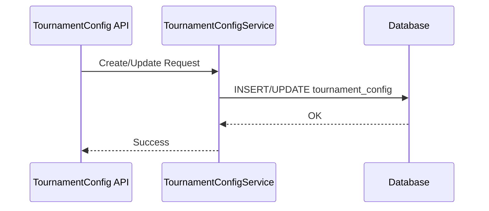

# Design: tournament_config CRUD

## 架构决策

### 决策 1：扩展属性建模

选择：使用 attributes JSON 字段承载扩展配置。

理由：CycleStageConfig 为扩展结构，不参与关系约束，保持单表可降低变更成本。

### 决策 2：删除策略

选择：逻辑删除。

规则：删除仅更新 is_deleted=1，历史数据可追溯。

### 决策 3：枚举持久化

选择：tournament_type、division_mode、match_mode、current_stage 统一 tinyint(3) unsigned。

理由：字段紧凑，兼容现有枚举 code 映射。

## 时序图

